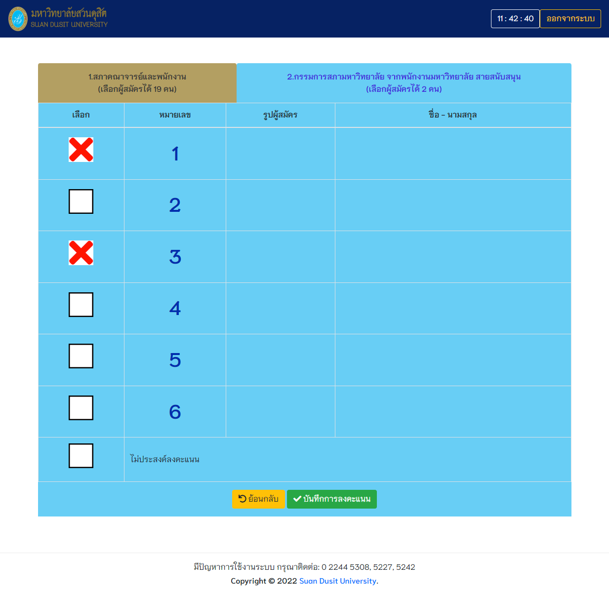

# sdu-evote
<!-- Improved compatibility of back to top link: See: https://github.com/othneildrew/Best-README-Template/pull/73 -->
<a name="readme-top"></a>
<!--
*** Thanks for checking out the Best-README-Template. If you have a suggestion
*** that would make this better, please fork the repo and create a pull request
*** or simply open an issue with the tag "enhancement".
*** Don't forget to give the project a star!
*** Thanks again! Now go create something AMAZING! :D
-->


<!-- PROJECT SHIELDS -->
<!--
*** I'm using markdown "reference style" links for readability.
*** Reference links are enclosed in brackets [ ] instead of parentheses ( ).
*** See the bottom of this document for the declaration of the reference variables
*** for contributors-url, forks-url, etc. This is an optional, concise syntax you may use.
*** https://www.markdownguide.org/basic-syntax/#reference-style-links
-->
[![Contributors][contributors-shield]][contributors-url]
[![Forks][forks-shield]][forks-url]
[![Stargazers][stars-shield]][stars-url]
[![Issues][issues-shield]][issues-url]
[![MIT License][license-shield]][license-url]


<!-- PROJECT LOGO -->
<br />
<div align="center">
  <a href="https://github.com/sontaya/sdu-evote">
    
  </a>

<h3 align="center">SDU Election</h3>

  <p align="center">
    ระบบเลือกตั้งกรรมการสภามหาวิทยาลัย จากพนักงานมหาวิทยาลัยสายสนับสนุน มหาวิทยาลัยสวนดุสิต
  </p>
</div>


<!-- ABOUT THE PROJECT -->
## About The Project

[![Product Name Screen Shot][product-screenshot]](https://www.dusit.ac.th/evote)




<p align="right">(<a href="#readme-top">back to top</a>)</p>


### Built With


* ![Codeigniter][Codeigniter]
* [![Bootstrap][Bootstrap.com]][Bootstrap-url]
* [![JQuery][JQuery.com]][JQuery-url]

<p align="right">(<a href="#readme-top">back to top</a>)</p>


### Installation

1. Clone the repo
   ```sh
   git clone https://github.com/sontaya/sdu-evote.git
   ```
2. Install Composer packages
   ```sh
   composer install
   ```
3. Import DB Schema


<p align="right">(<a href="#readme-top">back to top</a>)</p>


<!-- CONTACT -->
## Contact

Project Link: [https://github.com/sontaya/sdu-evote](https://github.com/sontaya/sdu-evote)

<p align="right">(<a href="#readme-top">back to top</a>)</p>


<!-- MARKDOWN LINKS & IMAGES -->
<!-- https://www.markdownguide.org/basic-syntax/#reference-style-links -->
[contributors-shield]: https://img.shields.io/github/contributors/sontaya/sdu-evote.svg?style=for-the-badge
[contributors-url]: https://github.com/sontaya/sdu-evote/graphs/contributors
[forks-shield]: https://img.shields.io/github/forks/sontaya/sdu-evote.svg?style=for-the-badge
[forks-url]: https://github.com/sontaya/sdu-evote/network/members
[stars-shield]: https://img.shields.io/github/stars/sontaya/sdu-evote.svg?style=for-the-badge
[stars-url]: https://github.com/sontaya/sdu-evote/stargazers
[issues-shield]: https://img.shields.io/github/issues/sontaya/sdu-evote.svg?style=for-the-badge
[issues-url]: https://github.com/sontaya/sdu-evote/issues
[license-shield]: https://img.shields.io/github/license/sontaya/sdu-evote.svg?style=for-the-badge
[license-url]: https://github.com/sontaya/sdu-evote/blob/master/LICENSE.txt
[linkedin-shield]: https://img.shields.io/badge/-LinkedIn-black.svg?style=for-the-badge&logo=linkedin&colorB=555
[linkedin-url]: https://linkedin.com/in/linkedin_username
[product-screenshot]: dev_assets/screenshot/screen01.png
[Vue.js]: https://img.shields.io/badge/Vue.js-35495E?style=for-the-badge&logo=vuedotjs&logoColor=4FC08D
[Vue-url]: https://vuejs.org/
[Bootstrap.com]: https://img.shields.io/badge/Bootstrap-563D7C?style=for-the-badge&logo=bootstrap&logoColor=white
[Bootstrap-url]: https://getbootstrap.com
[JQuery.com]: https://img.shields.io/badge/jQuery-0769AD?style=for-the-badge&logo=jquery&logoColor=white
[JQuery-url]: https://jquery.com
[Codeigniter]: dev_assets/readme/badge-ci.png
